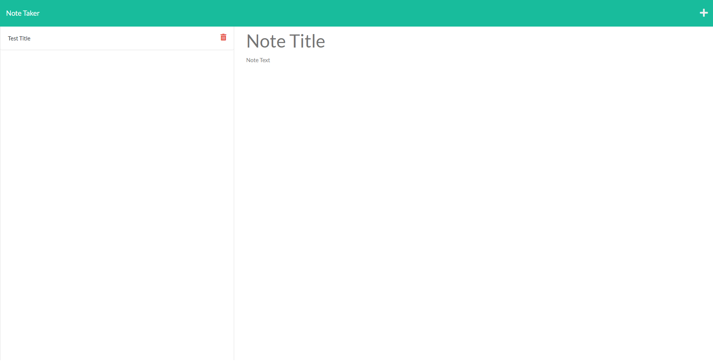

# Note Taker

## Description

A basic app designed to let the user store notes using a pseudo-database build with JSON and express.js

## Instructions

Press the start button when prompted, then freely fill in the text fields to save a note complete with title.

To save a note, press the little floppy disk icon in the top right when the fields are filled in.

To add a new note, press the plus button in the top right corner.

To delete a note, press the small red trash can icon next to the list of previous notes.

https://ddwk21-note-taker.herokuapp.com/notes

## Screenshot

